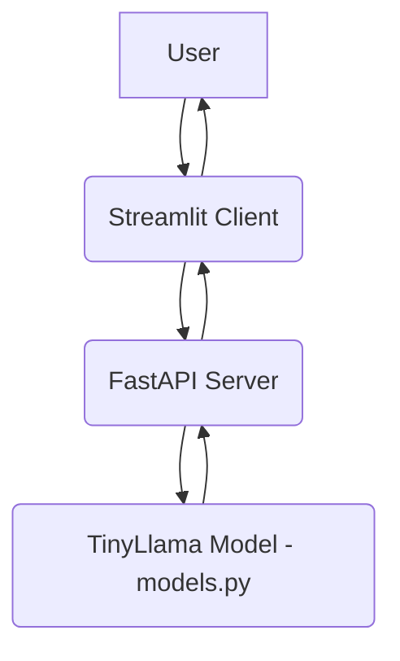

# LLM FastAPI Serving Project

## Overview

This project demonstrates the transition from experimental notebook environments to production-ready AI deployment using Python, FastAPI, and Streamlit. It architects a modular system to serve a local TinyLlama model, creates RESTful API endpoints, builds an interactive chat interface, and evaluates real-world performance metrics. This project strengthens your ability to operationalize generative AI, design scalable backend-frontend integrations, and translate model capabilities into practical user-facing applications using the Discovery-to-Action (DTA) framework.

## Project Goal

By the end of this project, the application should:
*   Successfully run a modular FastAPI + Streamlit architecture serving a local LLM.
*   Accept user prompts via a polished chat UI and return coherent, persona-aligned responses.
*   Demonstrate clear understanding of backend-frontend communication, API design, and request/response handling.
*   Identify performance bottlenecks and propose actionable optimization strategies for CPU-based inference.
*   Articulate practical business or educational applications for the deployed chatbot.
*   Provide a well-documented, reproducible repository ready for future cloud deployment or model swapping.

## Architecture

The project is structured into three main modules to ensure a clear separation of concerns:

*   `models.py`: Handles the loading and inference of the TinyLlama language model.
*   `main.py`: Sets up a FastAPI application to expose the model's capabilities via a RESTful API.
*   `client.py`: Implements a Streamlit-based interactive chat interface that communicates with the FastAPI backend.



## Setup and Installation

### Environment Configuration

1.  **Clone the Repository (if applicable):**
    ```bash
    git clone <your-repository-link>
    cd llm-fastapi-streamlit-deployment
    ```

2.  **Install Dependencies:**
    Ensure you have Python 3.8+ installed. Then, install the required packages:
    ```bash
    pip install torch transformers fastapi uvicorn nest_asyncio streamlit requests pyngrok
    ```
    *(Note: For Colab, some installations are handled directly within the notebook cells.)*

3.  **Hugging Face Token (Optional but Recommended):**
    For better performance and to avoid rate limits when downloading models, consider setting your Hugging Face token. You can obtain one from [Hugging Face Settings](https://huggingface.co/settings/tokens).

4.  **Ngrok Authentication Token:**
    To expose your Streamlit application publicly from Colab, you will need an `NGROK_AUTH_TOKEN`. Obtain one from [ngrok dashboard](https://dashboard.ngrok.com/get-started/your-authtoken). Add this token to your Google Colab secrets manager under the name `NGROK_AUTH_TOKEN`.

## Running the Application

### 1. `models.py` (Model Loading)

This file defines the `TinyLlamaModel` class, which loads the `TinyLlama/TinyLlama-1.1B-Chat-v1.0` model using `transformers` pipeline. It's designed to be instantiated once globally in the FastAPI application.

### 2. `main.py` (FastAPI Server)

This script sets up the FastAPI server with a `/generate` endpoint that accepts a user prompt and returns the model's response. The `TinyLlamaModel` is loaded once at startup to optimize performance.

**API Design:**
*   **Endpoint**: `POST /generate`
*   **Request Body**: 
    ```json
    {
      "prompt": "Your input prompt here",
      "max_new_tokens": 50 (optional, default: 50)
    }
    ```
*   **Response Body (Success)**:
    ```json
    {
      "prompt": "Your input prompt here",
      "response": "Generated text from TinyLlama"
    }
    ```
*   **Response Body (Error)**:
    ```json
    {
      "error": "Error message",
      "response": ""
    }
    ```

**To run the FastAPI server (in a separate terminal or Colab thread):**

```python
# This is typically run via uvicorn in a blocking manner.
# In a Colab environment, it's often started in a background thread.
import uvicorn
from main import app # Assuming 'app' is defined in main.py
uvicorn.run(app, host="0.0.0.0", port=8000)
```

### 3. `client.py` (Streamlit Chat Interface)

This script creates a conversational UI using Streamlit. It sends user prompts to the FastAPI backend and displays the responses. Error handling is included to manage connection issues with the backend.

**To run the Streamlit client (in a separate terminal or Colab thread):**

```bash
streamlit run client.py
```

### Concurrent Execution in Colab

The provided Colab notebook demonstrates how to run both the FastAPI server and Streamlit client concurrently within the Colab environment using Python's `threading` module and `pyngrok` to expose the Streamlit interface.

1.  **Ensure `NGROK_AUTH_TOKEN` is set** in Colab secrets.
2.  **Run the dedicated Colab cell** that starts both FastAPI and Streamlit threads and initiates the ngrok tunnel. A public URL will be printed for accessing the Streamlit app.

**Screenshot of Live Streamlit Interface:**


*(Please replace `<path-to-your-screenshot.png>` with an actual screenshot of your running Streamlit application.)*

## Bot Persona Customization

**Custom System Prompt Configuration:**

*(This section is currently not implemented in the provided code. You would extend `models.py` or the `generate_text` function to accept a system prompt and integrate it into the model's input.)*

To define your bot's persona (e.g., math tutor, code reviewer, domain specialist), you would typically include a `system_prompt` as part of the input to the LLM. This guides the model's behavior and response style. For example:

```python
# Example modification in models.py (conceptual)
class TinyLlamaModel:
    # ... (existing code)
    def generate_text(self, prompt: str, system_prompt: str = "", max_new_tokens: int = 50) -> str:
        if system_prompt:
            full_prompt = f"""<|system|>
{system_prompt}<|end|>
<|user|>
{prompt}<|end|>
<|assistant|>
"""
        else:
            full_prompt = f"""<|user|>
{prompt}<|end|>
<|assistant|>
"""
        # ... (rest of the generation logic using full_prompt)
```

**Concrete Use Case:**

*(Describe a concrete use case for your bot's persona here, explaining how it would assist students or employees in daily workflows. For example, if it's a 'Python Code Reviewer' persona:)*

*Example:* If the bot's persona is a **'Junior Data Scientist's Python Assistant'**, it could help new team members by providing explanations of complex Python code snippets, suggesting best practices for data manipulation using Pandas, or debugging common errors in machine learning workflows. For instance, a data scientist could paste a piece of code and ask,
